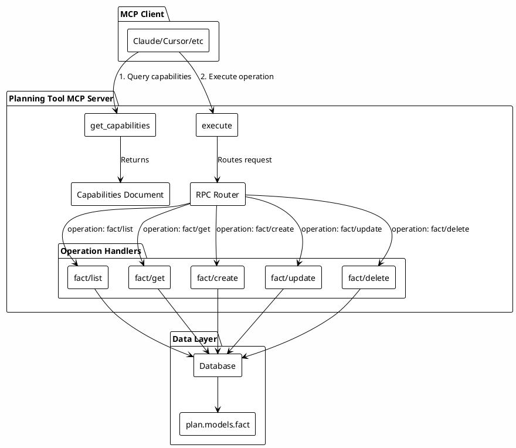
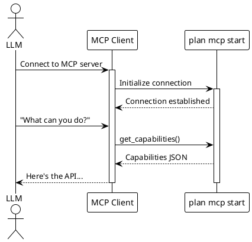
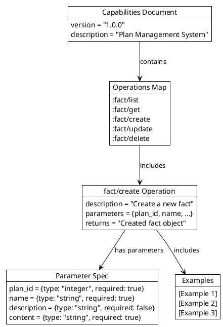
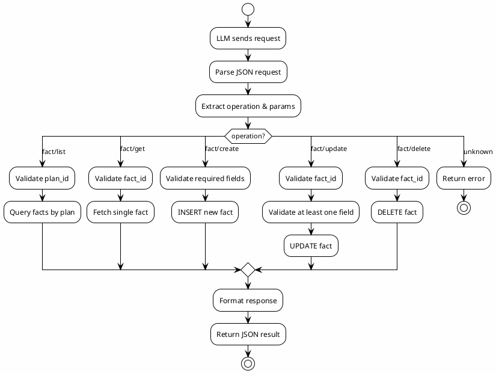

# MCP Server Architecture

This document describes the capabilities-based MCP server design for the planning tool.

## Overview

The planning tool MCP server uses an innovative **two-tool design** that prioritizes discoverability and elegance over the traditional "one tool per operation" approach.

## Design Philosophy

### Traditional MCP Design (5+ tools)

```
list_facts, get_fact, create_fact, update_fact, delete_fact...
```

**Problems:**
- Tool clutter in MCP client UI
- Hard to extend without client changes
- No self-discovery mechanism

### Capabilities-Based Design (2 tools)

```
get_capabilities + execute
```

**Benefits:**
- Clean, minimal tool interface
- Self-documenting via capabilities document
- Dynamic operation discovery
- Easy to extend (just add to capabilities)
- Natural RPC pattern LLMs understand

## Architecture Diagram



## Sequence Diagrams

### Initial Discovery Flow



### Fact Creation Flow

```plantuml
@startuml
!theme plain
actor User
participant "MCP Client" as Client
participant "plan mcp start" as Server
database SQLite

User -> Client: "Create a fact about the API endpoint"
activate Client

Client -> Server: execute({
  "operation": "fact/create",
  "plan_id": 1,
  "name": "API URL",
  "content": "https://api.example.com/v1"
})
activate Server

Server -> Server: Validate parameters

alt Validation fails
    Server --> Client: Error response
else Validation passes
    Server -> SQLite: INSERT INTO facts
    activate SQLite
    SQLite --> Server: New fact record
    deactivate SQLite
    
    Server --> Client: Success response
end

deactivate Server

Client --> User: "Created fact 'API URL' (ID: 42)"

deactivate Client

@enduml
```

### Error Handling Flow

```plantuml
@startuml
!theme plain
actor User
participant "MCP Client" as Client
participant "plan mcp start" as Server

User -> Client: "Get fact 9999"
activate Client

Client -> Server: execute({
  "operation": "fact/get",
  "fact_id": 9999
})
activate Server

Server -> Server: Query database
Server -> Server: Fact not found

Server --> Client: {
  "status": "error",
  "operation": "fact/get",
  "message": "Fact not found: 9999"
}
deactivate Server

Client --> User: "Fact not found"

deactivate Client

@enduml
```

## Capabilities Document Structure



## Data Flow



## Tool Definitions

### Tool 1: get_capabilities

| Property | Value |
|----------|-------|
| Name | `get_capabilities` |
| Description | Returns complete API specification |
| Parameters | None |
| Returns | JSON capabilities document |

**Purpose:** Self-discovery mechanism for LLM agents

### Tool 2: execute

| Property | Value |
|----------|-------|
| Name | `execute` |
| Description | Execute any operation via RPC |
| Required Parameter | `request` (JSON string) |
| Returns | JSON operation result |

**Request Format:**
```json
{
  "operation": "fact/create",
  "plan_id": 1,
  "name": "API URL",
  "content": "https://api.example.com/v1"
}
```

**Response Format:**
```json
{
  "status": "success",
  "operation": "fact/create",
  "data": {
    "id": 42,
    "plan_id": 1,
    "name": "API URL",
    "content": "https://api.example.com/v1",
    "created_at": "2025-01-30T...",
    "updated_at": "2025-01-30T..."
  }
}
```

## Supported Operations

| Operation | Description | Required Parameters |
|-----------|-------------|---------------------|
| `fact/list` | List all facts for a plan | `plan_id` |
| `fact/get` | Get fact by ID | `fact_id` |
| `fact/create` | Create new fact | `plan_id`, `name`, `content` |
| `fact/update` | Update existing fact | `fact_id` + at least one field |
| `fact/delete` | Delete fact by ID | `fact_id` |

## Benefits

### For LLM Agents
1. **Discoverability**: Query capabilities anytime to understand available operations
2. **Type Safety**: Full parameter schemas with types and required flags
3. **Examples**: Working examples for each operation
4. **Single Interface**: One tool to learn, many operations to use

### For Developers
1. **Minimal Surface Area**: Only 2 MCP tools to maintain
2. **Easy Extension**: Add operations without client changes
3. **Versioned**: Capabilities include version for compatibility
4. **Self-Testing**: Capabilities serve as living documentation

### For Users
1. **Clean UI**: No tool clutter in MCP client
2. **Consistent**: All operations use same interface pattern
3. **Transparent**: Can see exactly what the LLM can do

## CLI Commands

```bash
# Show MCP info
plan mcp info

# Start MCP server
plan mcp start

# Start with explicit nREPL port
plan mcp start --port 7889
```

## Client Configuration Example

### Claude Code
```bash
claude mcp add plan -- ./plan mcp start
```

### Claude Desktop (claude_desktop_config.json)
```json
{
  "mcpServers": {
    "plan": {
      "command": "/path/to/plan",
      "args": ["mcp", "start"]
    }
  }
}
```

## Future Extensions

The capabilities-based design makes it easy to add:

- Task operations (task/list, task/create, etc.)
- Plan operations (plan/list, plan/create, etc.)
- Search operations (search/query)
- Lesson operations (lesson/add, lesson/validate)

Simply add to the capabilities document and implement the handler!
